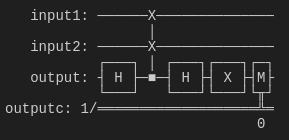
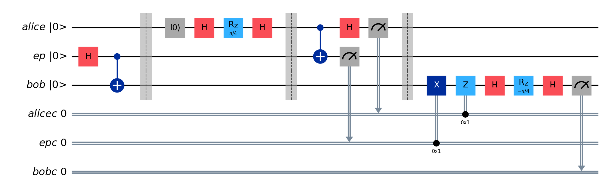
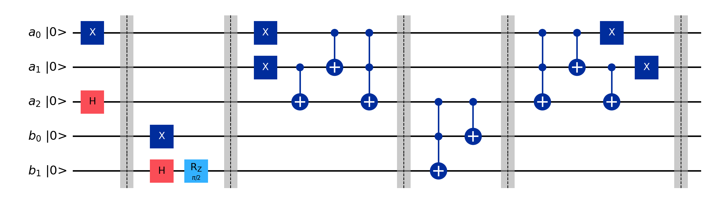

# Quantum Computing

We present several quantum computing algorithms. Each file is a standalone example.

First perform generic setup as follows.  

```bash
cd <path>/quantum
python3.8 -m venv ./.venv
source ./.venv/bin/activate
pip install --upgrade pip
pip install qiskit[visualization]
pip install qiskit-ibm-runtime
pip install matplotlib pylatexenc ipykernel
```

Users are recommended to run each of this repository's code files inside the interactive window in VSCode.

Alternatively, you may run the code inside JupyterLab. Follow the additional steps below to install and launch JupyterLab.
```bash
cd <path>/quantum
pip install jupyterlab
# Once installed, launch JupyterLab with:
jupyter lab
```

Optional libraries for code formatting.
```bash
cd <path>/quantum
pip install black[jupyter]
# Execute to format code.
black .
```

## Code

1. [Swap test](swap_test.py)

    

    Compare the states of two single-qubit registers. If the two input states are equal, the output register results in `∣1⟩` state. An useful interpretation is to see that the probability of a `|1⟩` outcome is a measure of just how identical the two inputs are.

1. [Teleport](teleport.py) 

    

    Alice teleports the quantum state of her payload qubit using an entangled pair of qubits shared with Bob. Only two classical bits are needed to transmit Alice’s qubit state (i.e., magnitudes and relative phase) and Bob's retrieved qubit state will be correct to a potentially infinite number of classical bits of precision. Because a traditional channel is needed to convey the two classical bits from Alice to Bob, the speed of teleportation can be no faster than the speed of light. <br>

    To verify successful teleportation, Bob applies the gates, which Alice applied on `∣0⟩` to prepare her payload, to his retrieved qubit in reverse. If Bob's retrieved qubit matches that sent by Alice, the final measurement result after verification gates should always be `0` in a perfect quantum circuit.

1. [Arithmetic](arithmetic.py)

    

    Create two quantum registers and initialize them to $a=\sqrt{0.5}|1⟩_{8}+\sqrt{0.5}|5⟩_{8}$ and $b=\sqrt{0.5}|1⟩_{4}+e^{\pi/4}\sqrt{0.5}|3⟩_{4}$. 