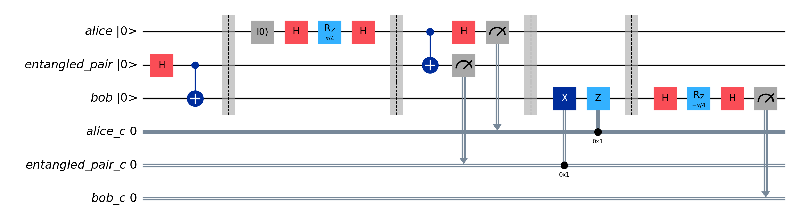
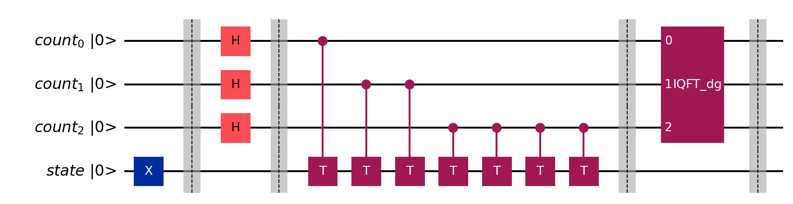

# Quantum Computing

We present several quantum computing algorithms. Each file is a standalone example.

First, perform generic setup as follows.  

```bash
cd <path>/quantum
python3.8 -m venv ./.venv
source ./.venv/bin/activate
pip install --upgrade pip
pip install qiskit[visualization]
pip install qiskit-ibm-runtime
pip install matplotlib pylatexenc ipykernel
```

Users are recommended to run each of this repository's code files inside the interactive window in VSCode.

Alternatively, users may run the code inside JupyterLab. Follow the additional steps below to install and launch JupyterLab.
```bash
cd <path>/quantum
pip install jupyterlab
# Once installed, launch JupyterLab with:
jupyter lab
```

Optional libraries for code formatting.
```bash
cd <path>/quantum
pip install black[jupyter]
# Execute to format code.
black .
```

## Code

1. [Swap test](swap_test.py)

    

    Compare the states of two single-qubit registers. If the two input states are equal, the output register results in `∣1⟩` state. An useful interpretation is to see that the probability of a `|1⟩` outcome is a measure of just how identical the two inputs are.

1. [Teleport](teleport.py)

    

    Alice teleports the quantum state of her payload qubit using an entangled pair of qubits shared with Bob. Only two classical bits are needed to transmit Alice’s qubit state (i.e., magnitudes and relative phase) and Bob's retrieved qubit state will be correct to a potentially infinite number of classical bits of precision. Because a traditional channel is needed to convey the two classical bits from Alice to Bob, the speed of teleportation can be no faster than the speed of light. <br>

    To verify successful teleportation, Bob applies the gates, which Alice applied on `∣0⟩` to prepare her payload, to his retrieved qubit in reverse. If Bob's retrieved qubit matches that sent by Alice, the final measurement result after verification gates should always be `0` in a perfect quantum circuit.

1. [Arithmetic](arithmetic.py)

    

    Create two quantum registers and initialize them to `a=sqrt(0.5)|1⟩+sqrt(0.5)|5⟩` and `b=sqrt(0.5)|1⟩+45°sqrt(0.5)|3⟩`. Decrement register `a` by 3. Then, increment register `b` conditional on register `a<0`. Here, register `a` is assumed to be in two’s-complement, where the highest-order bit indicates the sign. Finally, increment register `a` by 3.

1. [Scratch qubit](scratch_qubit.py)

    

    Scratch qubits play a temporary role in enabling quantum operations. A specific example of an otherwise irreversible operation that can be made reversible with a scratch qubit is `abs(a)`. The `abs()` function computes the absolute value of a signed integer. We assume two’s-complement notation here. <br>

    In this example, `abs` of a quantum register `a` is computed. Then, add `abs(a)` to another quantum register `b`. Finally, uncompute (i.e., reverse the operations on) the scratch qubit and quantum register `a` to return them to their initial states.

1. [Amplitude amplification](amplitude_amplification.py)

    

    Amplitude amplification converts inaccessible phase differences inside a quantum processor into measurable magnitude differences. Amplitue amplification consists of iterative `flip` followed by `mirror` subroutines. Subroutine `flip` marks the desired state by a phase-flip. Subroutine `mirror` reflects each state about the average overall state. This results in the marked state having a larger read probability than nonmarked states. In Grover search algorithm, the `flip` and `mirror` are known as the `oracle` and `diffuser`, respectively.

 1. [Quantum Fourier Transform](quantum_fourier_transform.py)

    

    Use Quantum Fourier Transform to deduce the frequencies present in a quantum register.

1. [Phase estimation](phase_estimation.py)

    

    Eigenstates and eigenphases correspond to the classical eigenvectors and eigenvalues, respectively.<br>

    We build a phase estimation circuit to compute the eigenphase, given a unitary quantum operation `U` and its eigenstate. Acting a `U` on its eigenstate produces the same eigenstate but with the eigenphase applied to its global phase. These eigenphase rotations are kicked-back into the top `eigenphase` register, creating a frequency modulation. Inverse QFT is applied to decode the frequency present in the top register, and thus find the underlying eigenphase. Relationship between top `eigenphase` register value `R`, eigenphase `θ`, and size of `eigenphase` register `m`, is `θ = R * 360 / 2^m`.<br>

    A superposition of eigenstates as an input to the phase estimation primitive results in a superposition of the associated eigenphases in the output. The magnitude for each eigenphase in the output superposition will be precisely the magnitude that its corresponding eigenstate had in the input register.